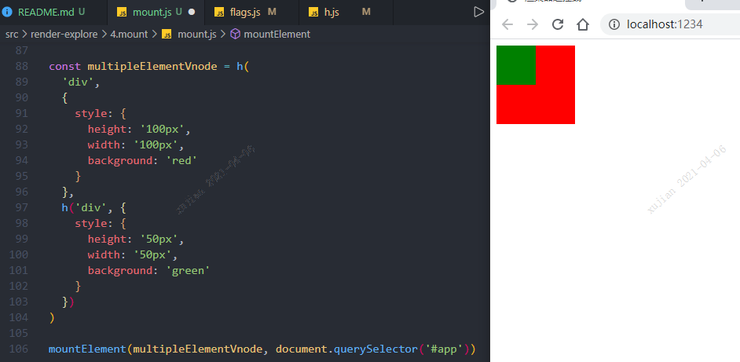
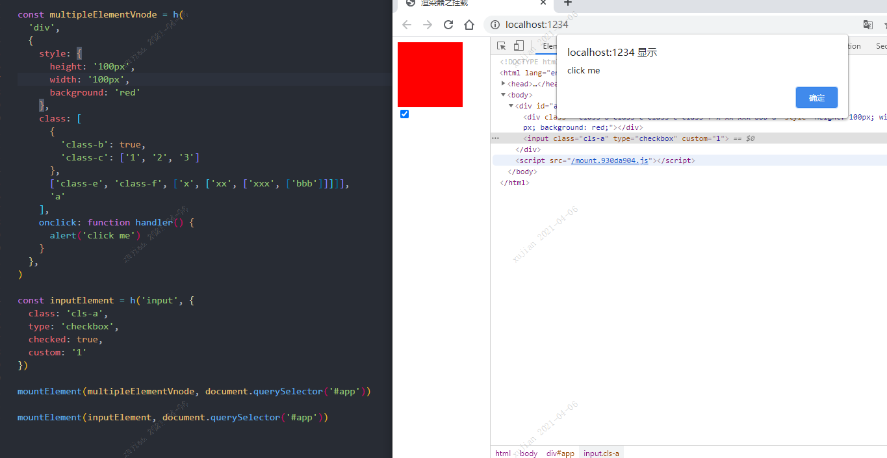

# 渲染器之挂载

## 责任重大的渲染器
所谓渲染器，简单的说就是将 Virtual DOM 渲染成特定平台下真实 DOM 的工具(就是一个函数，通常叫 render)，渲染器的工作流程分为两个阶段：mount 和 patch，如果旧的 VNode 存在，则会使用新的 VNode 与旧的 VNode 进行对比，试图以最小的资源开销完成 DOM 的更新，这个过程就叫 patch，或“打补丁”。如果旧的 VNode 不存在，则直接将新的 VNode 挂载成全新的 DOM，这个过程叫做 mount。  

通常渲染器接收两个参数，第一个参数是将要被渲染的 VNode 对象，第二个参数是一个用来承载内容的容器(container)，通常也叫挂载点，如下代码所示：

```js
function render(vnode, container) {
  const prevVNode = container.vnode
  if (prevVNode == null) {
    if (vnode) {
      // 没有旧的 VNode，只有新的 VNode。使用 `mount` 函数挂载全新的 VNode
      mount(vnode, container)
      // 将新的 VNode 添加到 container.vnode 属性下，这样下一次渲染时旧的 VNode 就存在了
      container.vnode = vnode
    }
  } else {
    if (vnode) {
      // 有旧的 VNode，也有新的 VNode。则调用 `patch` 函数打补丁
      patch(prevVNode, vnode, container)
      // 更新 container.vnode
      container.vnode = vnode
    } else {
      // 有旧的 VNode 但是没有新的 VNode，这说明应该移除 DOM，在浏览器中可以使用 removeChild 函数。
      container.removeChild(prevVNode.el)
      container.vnode = null
    }
  }
}
```

整体思路非常简单，如果旧的 VNode 不存在且新的 VNode 存在，那就直接挂载(mount)新的 VNode ；如果旧的 VNode 存在且新的 VNode 不存在，那就直接将 DOM 移除；如果新旧 VNode 都存在，那就打补丁(patch)：

| **旧 VNode** | **新 VNode** | **操作**        |
| ------------ | ------------ | --------------- |
| ❌            | ✅            | 调用 mount 函数 |
| ✅            | ❌            | 移除 DOM        |
| ✅            | ✅            | 调用 patch 函数 |

之所以说渲染器的责任非常之大，是因为它不仅仅是一个把 VNode 渲染成真实 DOM 的工具，它还负责以下工作：
1. **控制部分组件生命周期钩子的调用**  
   在整个渲染周期中包含了大量的 DOM 操作、组件的挂载、卸载，控制着组件的生命周期钩子调用的时机。
2. **多端渲染的桥梁**  
   渲染器也是多端渲染的桥梁，自定义渲染器的本质就是把特定平台操作“DOM”的方法从核心算法中抽离，并提供可配置的方案。
3. **与异步渲染有直接关系**  
   Vue3 的异步渲染是基于调度器的实现，若要实现异步渲染，组件的挂载就不能同步进行，DOM的变更就要在合适的时机，一些需要在真实DOM存在之后才能执行的操作(如 ref)也应该在合适的时机进行。对于时机的控制是由调度器来完成的，但类似于组件的挂载与卸载以及操作 DOM 等行为的入队还是由渲染器来完成的，这也是为什么 Vue2 无法轻易实现异步渲染的原因。
4. **包含最核心的 Diff 算法**  
   Diff 算法是渲染器的核心特性之一，可以说正是 Diff 算法的存在才使得 Virtual DOM 如此成功。

## 挂载普通标签元素
### 基本原理
渲染器的责任重大，所以它做的事情也非常多，一口吃成胖子是不太现实的，我们需要一点点地消化。

在初次调用渲染器渲染某个 VNode 时：
```js
const vnode = {/*...*/}
render(vnode, container)
```
由于没有旧的 VNode 存在，所以会调用 mount 函数挂载全新的 VNode ，这个小节我们就探讨一下渲染器的 mount 函数是如何把 VNode 渲染成真实 DOM 的，以及其中一些核心的关键点。  

mount 函数的作用是把一个 VNode 渲染成真实 DOM，根据不同类型的 VNode 需要采用不同的挂载方式，如下：
```js
function mount(vnode, container) {
  const { flags } = vnode
  if (flags & VNodeFlags.ELEMENT) {
    // 挂载普通标签
    mountElement(vnode, container)
  } else if (flags & VNodeFlags.COMPONENT) {
    // 挂载组件
    mountComponent(vnode, container)
  } else if (flags & VNodeFlags.TEXT) {
    // 挂载纯文本
    mountText(vnode, container)
  } else if (flags & VNodeFlags.FRAGMENT) {
    // 挂载 Fragment
    mountFragment(vnode, container)
  } else if (flags & VNodeFlags.PORTAL) {
    // 挂载 Portal
    mountPortal(vnode, container)
  }
}
```
我们根据 VNode 的 flags 属性值能够区分一个 VNode 对象的类型，不同类型的 VNode 采用不同的挂载函数：  

  

我们首先来讨论一下 mountElement 函数，它用于挂载普通标签元素。我们在"组件的本质"一章中曾经编写过如下这段代码：

```js
function mountElement(vnode, container) {
  const el = document.createElement(vnode.tag)
  container.appendChild(el)
}
```
这是一个极简的用于挂载普通标签元素的 mountElement 函数，它会调用浏览器提供的 document.createElement 函数创建元素，接着调用 appendChild 函数将元素添加到 container 中，但它具有以下缺陷：
1. VNode 被渲染为真实DOM之后，没有引用真实DOM元素
2. 没有将 VNodeData 应用到真实DOM元素上
3. 没有继续挂载子节点，即 children
4. 不能严谨地处理 SVG 标签

针对这四个问题，我们逐个去解决。先来看第一个问题：**`VNode` 被渲染为真实DOM之后，没有引用真实DOM元素**，这个问题很好解决，只需要添加一行代码即可：
```js {3}
function mountElement(vnode, container) {
  const el = document.createElement(vnode.tag)
  vnode.el = el
  container.appendChild(el)
}
```
再来看第二个问题：**没有将 `VNodeData` 应用到元素上**，我们知道 VNodeData 作为 VNode 的描述，对于标签元素来说它包含了元素的样式、事件等诸多信息，我们需要将这些信息应用到新创建的真实DOM元素上，假设我们有如下 VNode：

> TIP  
>再次强调，本章使用上一章节中所编写的 h 函数。

```js
const elementVnode = h(
  'div',
  {
    style: {
      height: '100px',
      width: '100px',
      background: 'red'
    }
  }
)
```
我们使用 h 函数创建了一个描述 div 标签的 VNode 对象，观察 VNodeData 可以发现，它拥有一些内联样式，所以在 mountElement 函数内，我们需要将这些内联样式应用到元素上，我们给 mountElement 增加如下代码：

```js {4-19}
function mountElement(vnode, container) {
  const el = document.createElement(vnode.tag)

  // 拿到 VNodeData
  const data = vnode.data
  if (data) {
    // 如果 VNodeData 存在，则遍历之
    for(let key in data) {
      // key 可能是 class、style、on 等等
      switch(key) {
        case 'style':
          // 如果 key 的值是 style，说明是内联样式，逐个将样式规则应用到 el
          for(let k in data.style) {
            el.style[k] = data.style[k]
          }
        break
      }
    }
  }

  container.appendChild(el)
}
```

如上代码所示，在创建真实DOM之后，我们需要检查 VNodeData 是否存在，如果 VNodeData 存在则遍历之。由于 VNodeData 中不仅仅包含内联样式的描述(即 style)，还可能包含其他描述如 class、事件等等，所以我们使用 switch...case 语句对不同的 key 值做区分处理，以 style 为例，我们只需要将 data.style 中的样式规则应用到真实DOM即可。使用渲染器渲染 elementVNode 的效果如下：  


对于 class 或事件或其他DOM属性都是类似的处理方式，为了不偏题我们放到后面统一讲解，接下来我们来看第三个问题：**没有继续挂载子节点**，即 children，我们知道 VNode 是有可能存在子节点的，现在的 mountElement 函数仅仅将该 VNode 本身所描述的DOM元素添加到了页面中，却没有理会其子节点，为了递归地挂载子节点，我们需要为 mountElement 函数增加如下代码：
```js {6-12}
function mountElement(vnode, container) {
  const el = document.createElement(vnode.tag)
  vnode.el = el
  // 省略处理 VNodeData 相关的代码

  // 递归挂载子节点
  if (vnode.children) {
    for (let i = 0; i < vnode.children.length; i++) {
      mountElement(vnode.children[i], el)
    }
  }

  container.appendChild(el)
}
```
观察如上代码中用来递归挂载子节点的代码，我们默认把 `vnode.children` 当作数组来处理，同时递归挂载的时候调用的仍然是 `mountElement` 函数。这存在两个瑕疵，第一个瑕疵是 `VNode` 对象的 `children` 属性不总是数组，因为当 `VNode` 只有一个子节点时，该 `VNode` 的 `children` 属性直接指向该子节点，且 `VNode` 的 `childFlags` 的值为 `ChildrenFlags.SINGLE_VNODE`，所以我们不应该总是使用 `for` 循环遍历 `vnode.children`。第二个瑕疵是我们在 `for` 循环内部直接调用了 `mountElement` 属性去挂载每一个 `children` 中的 `VNode` 对象，但问题是 `children` 中的 `VNode` 对象可能是任意类型的，所以我们不应该直接调用 `mountElement` 函数，而是应该调用 `mount` 函数。更加严谨的代码如下：
```js {6-22}
function mountElement(vnode, container) {
  const el = document.createElement(vnode.tag)
  vnode.el = el
  // 省略处理 VNodeData 的代码

  // 拿到 children 和 childFlags
  const childFlags = vnode.childFlags
  const children = vnode.children
  // 检测如果没有子节点则无需递归挂载
  if (childFlags !== ChildrenFlags.NO_CHILDREN) {
    if (childFlags & ChildrenFlags.SINGLE_VNODE) {
      // 如果是单个子节点则调用 mount 函数挂载
      mount(children, el)
    } else if (childFlags & ChildrenFlags.MULTIPLE_VNODES) {
      // 如果是单多个子节点则遍历并调用 mount 函数挂载
      for (let i = 0; i < children.length; i++) {
        mount(children[i], el)
      }
    }
  }

  container.appendChild(el)
}
```
如上代码所示，我们通过 `vnode.childFlags` 拿到该 `VNode` 子节点的类型，接着检测其是否含有子节点，如果存在子节点，会检测是单个子节点还是多个子节点，只有当存在多个子节点时其 `children` 属性才是可遍历的数组，最后调用 `mount` 函数挂载之。

我们尝试修改之前的 `elementVNode`，为其添加子节点：
```js
const elementVnode = h(
  'div',
  {
    style: {
      height: '100px',
      width: '100px',
      background: 'red'
    }
  },
  h('div', {
    style: {
      height: '50px',
      width: '50px',
      background: 'green'
    }
  })
)
```
如上代码可知，我们为 `elementVnode` 添加了一个子节点，该子节点是一个边长为 50px 的绿色正方形，使用渲染器渲染修改后的 `elementVnode` 的效果如下：  



接着我们来看最后一个问题：**不能严谨地处理 SVG 标签**，在之前的 `mountElement` 函数中我们使用 `document.createElement` 函数创建`DOM`元素，但是对于 `SVG` 标签，更加严谨的方式是使用 `document.createElementNS` 函数，修改 `mountElement` 如下：

```js {2-5}
function mountElement(vnode, container) {
  const isSVG = vnode.flags & VNodeFlags.ELEMENT_SVG
  const el = isSVG
    ? document.createElementNS('http://www.w3.org/2000/svg', vnode.tag)
    : document.createElement(vnode.tag)
  vnode.el = el
  // 省略...
}
```

我们通过 `vnode.flags` 来判断一个标签是否是 `SVG`，但是大家不要忘记 `vnode.flags` 是如何被标记为 `VNodeFlags.ELEMENT_SVG`的，我们在讲解 `h` 函数时说明过这个问题，如下代码所示：

```js
function h(tag, data, children) {
  let flags = null
  if (typeof tag === 'string') {
    flags = tag === 'svg' ? VNodeFlags.ELEMENT_SVG : VNodeFlags.ELEMENT_HTML
  }
}
```

我们注意到，只有当标签名字全等于字符串 `'svg'` 时，该 `VNode` 的 `flags` 才会被标记为 `VNodeFlags.ELEMENT_SVG`，这意味着 `<circle/>` 标签不会被标记为 `VNodeFlags.ELEMENT_SVG`，所以在创建 `<circle/>` 元素时并不会使用 `document.createElementNS` 函数，但 `<circle/>` 标签确实是 `svg` 标签，如何解决这个问题呢？其实很简单，因为 svg 的书写总是以 `<svg>` 标签开始的，所有其他 `svg` 相关的标签都是 `<svg>` 标签的子代元素。所以解决方案就是：在 `mountElement` 函数中一旦 `isSVG` 为真，那么后续创建的所有子代元素都会被认为是 `svg` 标签，我们需要修改 `mountElement` 函数，为其添加第三个参数，如下：
```js {1,2,10,11,14,15}
function mountElement(vnode, container, isSVG) {
  isSVG = isSVG || vnode.flags & VNodeFlags.ELEMENT_SVG
  const el = isSVG
    ? document.createElementNS('http://www.w3.org/2000/svg', vnode.tag)
    : document.createElement(vnode.tag)
  // 省略处理 VNodeData 的代码

  const childFlags = vnode.childFlags
  if (childFlags !== ChildrenFlags.NO_CHILDREN) {
    if (childFlags & ChildrenFlags.SINGLE_VNODE) {
      // 这里需要把 isSVG 传递下去
      mount(children, el, isSVG)
    } else if (childFlags & ChildrenFlags.MULTIPLE_VNODES) {
      for (let i = 0; i < children.length; i++) {
        // 这里需要把 isSVG 传递下去
        mount(children[i], el, isSVG)
      }
    }
  }

  container.appendChild(el)
}
```

如上代码所示，我们为 mountElement 增加了第三个参数 isSVG，接着在判断一个 VNode 是否是 svg 元素时优先使用参数中的 isSVG 作为判断条件，并且使用 vnode.flags & VNodeFlags.ELEMENT_SVG 作为回退判断条件，最后在挂载子节点的时候将 isSVG 参数传递下去。这样我们就能达到一个目的：**即使 <circle/> 标签对应的 vnode.flags 不是 VNodeFlags.ELEMENT_SVG，但在 mountElement 函数看来它依然是 svg 标签。**

### class的处理
前面我们在 mountElement 函数中实现了将内联样式应用到元素的功能，接着我们来想办法将 class 也应用到元素上，在开始实现功能之前我们第一步要做的是：**设计数据结构**，比如我们采用了 data.style 来存储内联样式的数据，并且其数据结构就是一个 key-value 的映射，对于 class 我们希望使用 data.class 来存储其数据，并且我们希望 data.class 的值就是类名字符串，例如：
```js
const elementVnode = h(
  'div',
  {
    class: 'cls-a cls-b'
  }
)
```
这样我们就可以轻松将类名列表添加到DOM元素上，我们为 `mountElement` 添加如下代码：

```js {14-20}
function mountElement(vnode, container, isSVG) {
  // 省略...

  const data = vnode.data
  if (data) {
    for (let key in data) {
      switch (key) {
        case 'style':
          for (let k in data.style) {
            el.style[k] = data.style[k]
          }
          break
        case 'class':
          el.className = data[key]
          break
        default:
          break
      }
    }
  }

  // 省略...
}
```
如上高亮代码所示，我们给 `switch` 添加了一个 `case` 语句块，用来匹配 `VNodeData` 中的 `class` 数据，由于我们将 `data.class` 设计成了可直接使用的类名列表字符串，所以只需要直接将 `data.class` 赋值给 `el.className` 即可。  

但是我们需要额外思考一些东西。在上面的讲解中我们直接把 data.class 的数据结构设计成可直接使用的类名列表字符串，但这是很底层的设计，换句话说这是框架层面的设计，我们还需要考虑应用层的设计，什么意思呢？来看如下这段模板：

```html
<template>
  <div class="cls-a" :class="dynamicClass"></div>
</template>
```
在这段模板中我们同时使用了 `class` 属性和绑定的 `:class` 属性，对于非绑定的 `class` 属性来说它的值就是我们最终想要的类名列表字符串，但是对于绑定的 `:class` 属性来说它的值是动态的 `javascript` 值，所以我们需要设计一下哪些值是被允许的。

```js
// 1.数组
dynamicClass = ['class-b', 'class-c']

// 2.对象
dynamicClass = {
  'class-b': true,
  'class-c': true
}
```
在编译器对模板进行编译时，还有非绑定和绑定的 class 属性值合并情况，如下是我们期望编译器对上面模板的编译结果：
```js
h('div', {
  class: ['class-a', dynamicClass]
})

// 如果 dynamicClass 是数组，那么如上代码等价于：
h('div', {
  class: ['class-a', ['class-b', 'class-c']]
})

// 如果 dynamicClass 是对象，那么编译的结果等价于：
h('div', {
  class: [
    'class-a',
    {
      'class-b': true,
      'class-c': true
    }
  ]
})
```
可以看到在使用 `h` 函数创建 `VNode` `时，VNodeData` 中的 `class` 还不可能是我们最终想要的类名列表字符串，那怎么办呢？很简单，我们只需要在 `h` 函数内部编写一个函数将如上数据结构序列化成我们想要的类名列表字符串就可以了。

```js
function bindClass(el, className) {
  if (typeof className === "string") {
    el.className = className
  } else {
    let names = ''
    function spreadClass(classes) {
      for (let key in classes) {
        const item = classes[key]
        if (typeof item === 'string') {
          names = names + ' ' + classes[key]
        }
        if (item === true) {
          names = names + ' ' + key
        }
        if (isType.call(item) === '[object Object]') {
          for(let skey in item) {
            if(item[skey]) names = names + ' ' + skey
          }
        }
        if (Array.isArray(item)) {
          spreadClass(item)
        }
      }
    }
    if (className && typeof className === 'object') {
      spreadClass(className)
      el.className = names
    }
  }
}
```

实际上，通过对 `class` 的讲解，我们涉及了在框架设计中比较重要的概念：**应用层的设计**，这是框架设计的核心，在设计一个功能的时候，你首先要考虑的应该是应用层的使用，然后再考虑如何与底层衔接。还是以 `class` 为例，为一个标签元素设置类名的方法是可定的(调用 `el.className` 或 `setAttribute`)，关键就在于你想在应用层做出怎样的设计，很自然的你要思考如何转化应用层的数据结构与底层衔接。

### Attributes 和 DOM Properties
接下来我们讲一讲DOM的 Attributes 以及 Properties，下面我们分别简称他们为 attr 和 DOM Prop，那么他们两个之间有什么区别呢？这里我们简单解释一下，我们知道浏览器在加载页面之后会对页面中的标签进行解析，并生成与之相符的 DOM 对象，每个标签中都可能包含一些属性，如果这些属性是标准属性，那么解析生成的DOM对象中也会包含与之对应的属性，例如：

```html
<body id="page"></body>
```
由于 id 是标准属性，所以我们可以通过 `document.body.id` 来访问它的值，实际上我们常说的 Attr 指的就是那些存在于标签上的属性，而 DOM Prop 就是存在于DOM对象上的属性。但是当标签上存在非标准属性时，该属性不会被转化为 DOM Prop，例如：
```html
<body custom="val"></body>
```
由于 custom 是非标准属性，所以当你尝试通过 document.body.custom 访问其值时会得到 undefined，这也是为什么 setAttribute 方法存在的原因，因为该方法允许我们为 DOM 元素设置自定义属性（不会初始化同名的 property）。另外该方法也允许我们为 DOM 元素设置标准属性的值，所以我们可不可以总是使用 setAttribute 设置全部的 DOM 属性呢？答案是：不行。举个例子：
```js
// checkbox 元素
const checkboxEl = document.querySelector('input')
// 使用 setAttribute 设置 checked 属性为 false
checkboxEl.setAttribute('checked', false)

console.log(checkboxEl.checked) // true
```
可以看到虽然我们使用 setAttribute 函数将复选框的 checked 属性设置为 false，但是当我们访问 checkboxEl.checked 时得到的依然是 true，这是因为在 setAttribute 函数为元素设置属性时，无论你传递的值是什么类型，它都会将该值转为字符串再设置到元素上，所以如下两句代码是等价的：
```js
checkboxEl.setAttribute('checked', false)
// 等价于
checkboxEl.setAttribute('checked', 'false')
```
>TIP：  
>一些特殊的 attribute，比如 checked/disabled 等，只要出现了，对应的 property 就会被初始化为 true，无论设置的值是什么,只有调用 removeAttribute 删除这个 attribute，对应的 property 才会变成 false。

这就指引我们有些属性不能通过 setAttribute 设置，而是应该直接通过 DOM 元素设置：el.checked = true。好在这样的属性不多，我们可以列举出来：value、checked、selected、muted。除此之外还有一些属性也需要使用 Property 的方式设置到 DOM 元素上，例如 innerHTML 和 textContent 等等。

才我们讲解了为什么同样是写在标签上的属性，却要区分对待的原因，接下来我们进入正题，开始完成将属性应用到 DOM 元素上的实现，到目前为止，我们已经为 VNodeData 设计了三个属性，如下：
```js
{
  style: ..., // 内联样式数据
  class: ..., // class 数据
  target: ... // Portal 的挂载目标
}
```
接下来我们还会为 VNodeData 添加更多属性，用来存储标签的数据，如下 input 标签所示：
```html
<input class="cls-a" type="checkbox" checked custom="1"/>
```
它有四个属性，我们打算在 VNodeData 中存储其属性名以及数据：
```js
h('input', {
  class: 'cls-a',
  type: 'checkbox',
  checked: true,
  custom: '1'
})
```
如上代码所示，我们已经实现了关于 class、style 的处理，所以接下来我们要处理的就是 VNodeData 中除 class 和 style 之外的全部数据，当然也要排除 VNodeData 中的 target 属性，因为它只用于 Portal。处理方式很简单，我们为 mountElement 函数添加如下高亮代码：
```js {1,18-24}
const domPropsRE = /\[A-Z]|^(?:value|checked|selected|muted)$/
function mountElement(vnode, container, isSVG) {
  // 省略...

  const data = vnode.data
  if (data) {
    for (let key in data) {
      switch (key) {
        case 'style':
          for (let k in data.style) {
            el.style[k] = data.style[k]
          }
          break
        case 'class':
          el.className = data[key]
          break
        default:
          if (domPropsRE.test(key)) {
            // 当作 DOM Prop 处理
            el[key] = data[key]
          } else {
            // 当作 Attr 处理
            el.setAttribute(key, data[key])
          }
          break
      }
    }
  }

  // 省略...
}
```

如上高亮代码所示，我们首先创建了一个正则表达式 domPropsRE，用来检测那些应该以 Property 的方式添加到 DOM 元素上的属性，其他的属性使用 setAttribute 方法设置。另外我们注意到正则 domPropsRE 除了用来匹配我们前面说过的固定的几个属性之外，它还能匹配那些拥有大写字母的属性，这是为了匹配诸如 innerHTML、textContent 等属性设计的，同时这也顺便实现了一个特性，即拥有大写字母的属性我们都会采用 el[key] = xxx 的方式将其添加到 DOM 元素上。

如下是渲染上面 input 标签的效果图：  


### 事件的处理
现在我们只剩下为 DOM 元素添加事件了，实际上在 mount 阶段为 DOM 元素添加事件很容易，我们只需要在元素对象上调用 addEventListener 方法即可，关键在于我们的 VNodeData 要如何设计。

通常我们给元素添加事件的规则是**使用 v-on 或 @ 符号加上事件名字**，例如给元素添加点击事件：
```html
<div @click="handler"></div>
```
当然事件名字中不包含 'on' 前缀，即 click 而不是 onclick，我们可以用如下 VNode 对象来描述如上模板：
```js
const elementVNode = h('div', {
  click: handler
})
```
然而这么做是有问题的，如上代码所示 elementVNode 的 VNodeData 中的 click 属性没办法与其他DOM属性区分，所以渲染器并不知道 click 属性代表的是事件，当然我们可以做出规定，例如我们规定 VNodeData 中的 click 属性是个特殊的属性，它用来存储事件回调函数，但这是很笨的方法，因为 DOM 原生事件很多，这种方案需要我们一一列举所有 DOM 事件并且扩展性很差。所以我们需要考虑如何将事件与属性区分，其实我们就沿用原生 DOM 对象的设计即可，在原生 DOM 对象中所有事件函数的名字都是 'on' + 事件名称 的形式，所以我们可以在 VNodeData 中使用 onclick 代替 click：
```js
const elementVNode = h('div', {
  onclick: handler
})
```
当然从模板到 VNodeData 的这个变化是由编译器来做的，这样设计之后我们就可以很容易地区分 VNodeData 中的某个属性是 DOM 属性还是 DOM 事件：**只需要检测属性名的前两个字符是不是 'on' 即可**。

在区分出事件之后，我们就可以着手将事件添加到 DOM 元素上了，只需调用 el.addEventListener 方法即可，如下：
```js {21-23}
function mountElement(vnode, container, isSVG) {
  // 省略...

  const data = vnode.data
  if (data) {
    for (let key in data) {
      switch (key) {
        case 'style':
          for (let k in data.style) {
            el.style[k] = data.style[k]
          }
          break
        case 'class':
          if (isSVG) {
            el.setAttribute('class', data[key])
          } else {
            el.className = data[key]
          }
          break
        default:
          if (key[0] === 'o' && key[1] === 'n') {
            // 事件
            el.addEventListener(key.slice(2), data[key])
          } else if (domPropsRE.test(key)) {
            // 当作 DOM Prop 处理
            el[key] = data[key]
          } else {
            // 当作 Attr 处理
            el.setAttribute(key, data[key])
          }
          break
      }
    }
  }

  // 省略...
}
```

如上高亮代码所示，我们通过检查 VNodeData 对象的键名(key)的前两个字符是否是 'on'，来区分其是否是事件，如果是事件则调用 el.addEventListener 将事件回调函数添加到元素上。

我们可以测试一下我们的代码：

```js
// 事件回调函数
function handler() {
  alert('click me')
}

// VNode
const elementVnode = h('div', {
  style: {
    width: '100px',
    height: '100px',
    backgroundColor: 'red'
  },
  // 点击事件
  onclick: handler
})

render(elementVnode, document.getElementById('app'))
```
其效果如下，当点击红色方块时会触发点击事件执行回调函数：  


